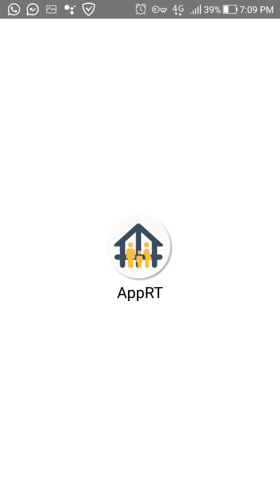
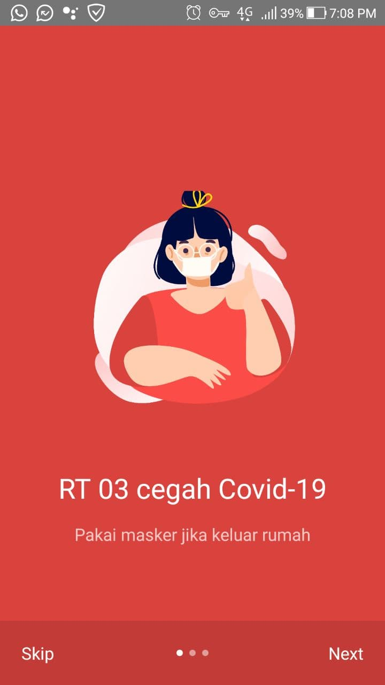
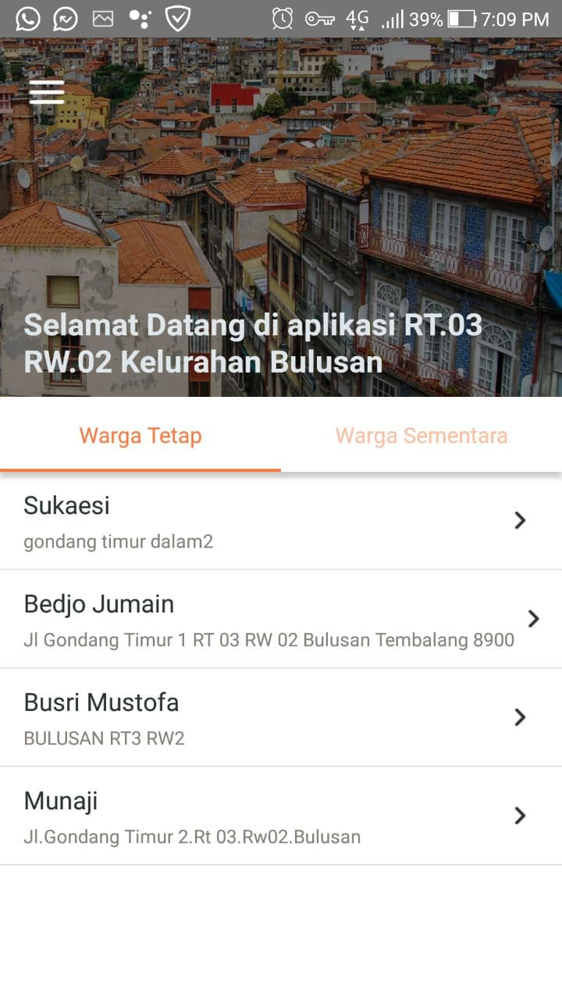
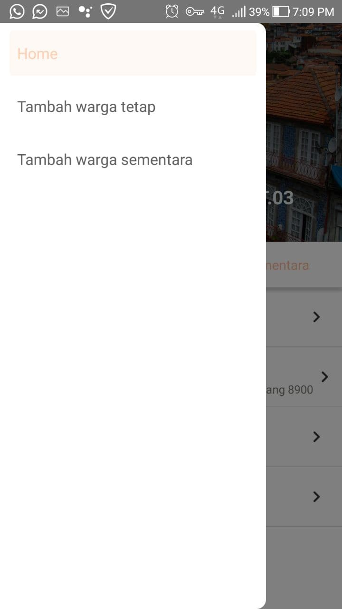
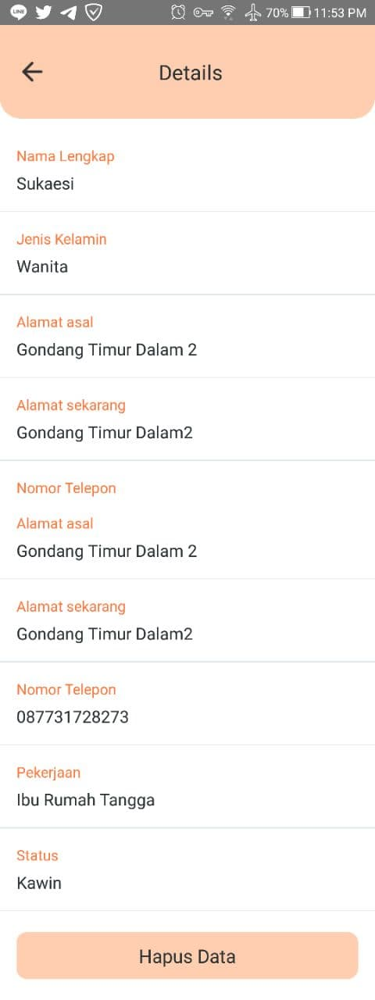
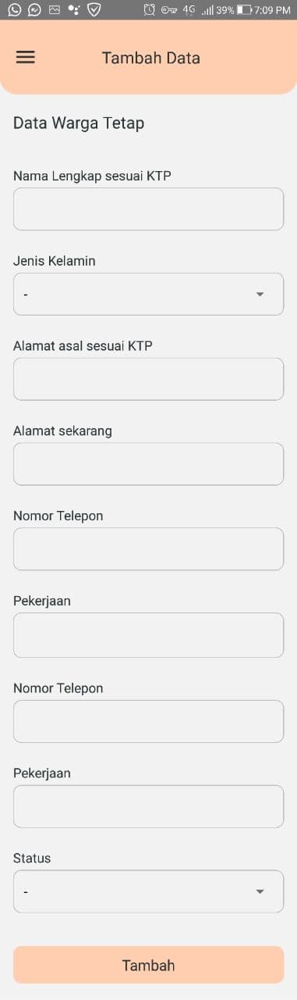

## Table of contents

- [Overview](#overview)
  - [Project](#project)
  - [Screenshot](#screenshot)
- [My process](#my-process)
  - [Built with](#built-with)
  - [What I learned](#what-i-learned)
- [Author](#author)

## Overview

### Project

Aplikasi CRUD Sederhana Pendataan Warga RT

### Screenshot

Here the result of my project

Splashscreen 👇            |  Onboarding Screen 👇
:-------------------------:|:-------------------------:
  |  

Home Screen 👇           |  Sidebar 👇
:-------------------------:|:-------------------------:
  |  

Detail Screen 👇          |  Tambah Data Screen 👇
:-------------------------:|:-------------------------:
  |  

## My process

### Built with

- React Native 0.63.4
- React Navigation
- React Hook Form
- Firebase (for Database)

## Author

- Website - [Soon](https://github.com/Afrizalbs) 🔜
- Twitter - [@afrizalbagas](https://twitter.com/afrizalbagas)
